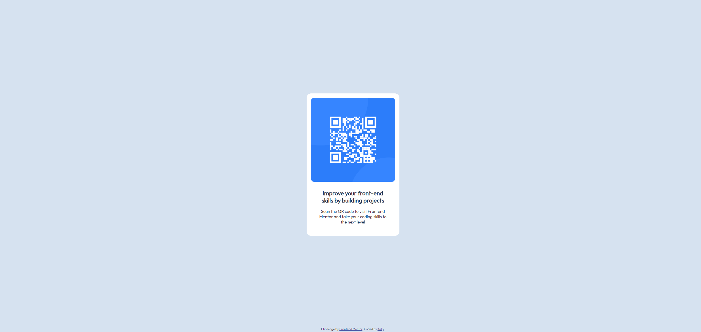

# Frontend Mentor - QR code component solution

This is a solution to the [QR code component challenge on Frontend Mentor](https://www.frontendmentor.io/challenges/qr-code-component-iux_sIO_H). Frontend Mentor challenges help you improve your coding skills by building realistic projects.

## Table of contents

- [Overview](#overview)
  - [Screenshot](#screenshot)
  - [Links](#links)
- [My process](#my-process)
  - [Built with](#built-with)
  - [What I learned](#what-i-learned)
  - [Continued development](#continued-development)
  - [Useful resources](#useful-resources)
- [Author](#author)

**Note: Delete this note and update the table of contents based on what sections you keep.**

## Overview

### Screenshot



### Links

- Solution URL: [Add solution URL here](https://github.com/StarFilledDonut/Solution-to-qr-code-challenge)
- Live Site URL: [Add live site URL here](https://starfilleddonut.github.io/Solution-to-qr-code-challenge/)

## My process

### Built with

- Semantic HTML5 markup
- CSS custom properties
- Flexbox

### What I learned

Practiced the use of Flexbox in my code.

```css
#qrSection {
  background-color: white;

  width: 300px;
  height: auto;

  display: flex;
  flex-direction: column;
  align-items: center;

  padding: 1em;
  padding-bottom: 2em;
  border-radius: 16px;
  margin: 13% 0;
}
```

And the how to control the user interaction with my links.

```html
<a href="https://github.com/StarFilledDonut" target="_blank">Kelly</a>.
```

### Continued development

I will continue to learn and practice the concepts of Flexbox in my projects as well as start to learn the use of Grids.

### Useful resources

- [HTML Path](https://www.w3schools.com/html/html_filepaths.asp#gsc.tab=0&gsc.q=target) - This helped me for bringing an image in my directory in my page.
- [HTML <a> target Attribute](https://www.w3schools.com/tags/att_a_target.asp) - For defining the interaction of the user with my links.

## Author

- Frontend Mentor - [@StarFilledDonut](https://www.frontendmentor.io/profile/StarFilledDonut)
- Twitter - [@PenguinsDriving](https://twitter.com/PenguinsDriving)
